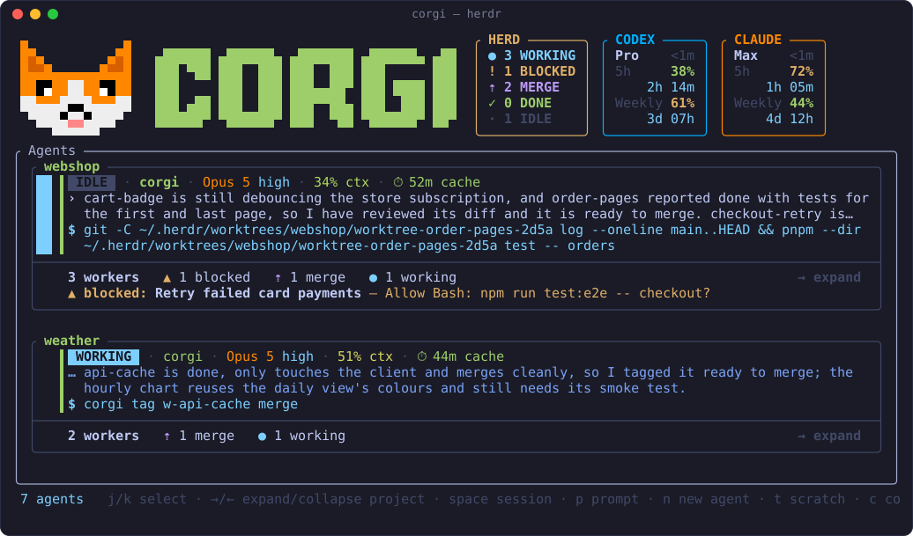
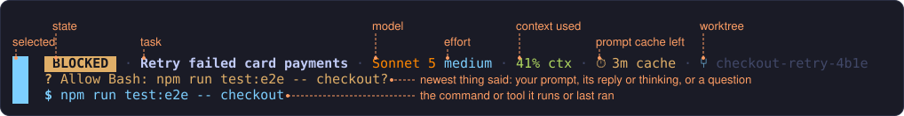
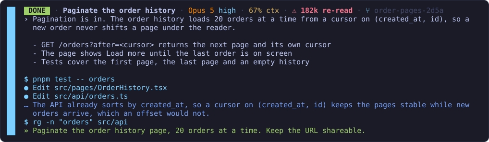
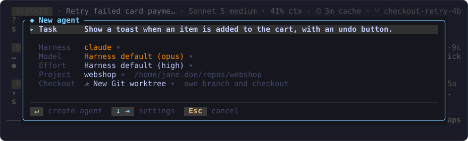
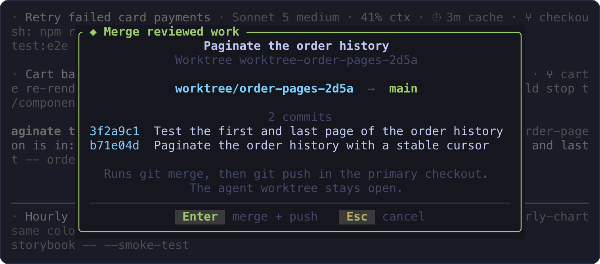
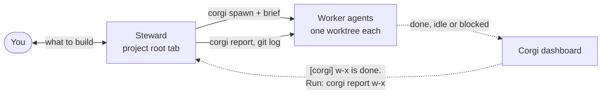

<p align="center">
  
</p>

<p align="center">
  <b>The dashboard for your Herdr agents.</b><br>
  Every coding agent in your Herdr session in one pane, grouped by project:
  what it is doing, what it waits on, and what its context and prompt cache
  cost you. Easily send prompts, start new sessions and close old ones
  directly from the same place.
</p>



## Install

```bash
herdr plugin install zyrre/corgi
```

It also links the `corgi` command into `~/.local/bin`. Run it again to update; `herdr plugin uninstall io.github.zyrre.corgi` removes it but leaves the link (`rm ~/.local/bin/corgi`). To open the dashboard with `prefix+d`, or focus it when it is already open, add this to `~/.config/herdr/config.toml` and run `herdr server reload-config`:

```toml
[[keys.command]]
key = "prefix+d"
type = "plugin_action"
command = "io.github.zyrre.corgi.open"
description = "Corgi (open or focus)"
```

## What you get

- **One row per agent** of any kind Herdr can start, such as Codex and Claude Code, grouped by project.
- **What needs you first**: the Steward, then blocked, working, done and idle; within a state, the agent that arrived there last comes first.
- **What each agent is doing**: the newest thing said in its session and the command or tool it runs.
- **What it costs**: its model and effort, how full its context is, how long its prompt cache stays warm, and in the header, each CLI's 5-hour and weekly plan usage.
- **New agents in their own worktree** with `n`, and their work merged back with `m`.
- **A Steward per project**: a long-lived agent you talk to, which dispatches the work to worktree agents.

## Keys

| Key | Action |
| --- | --- |
| `j` / `k`, arrows | Select an agent |
| `space`, then `u` / `d`, `PgUp` / `PgDn` | Expand the selected session into its transcript and scroll it; `space` collapses it |
| `p` | Prompt the selected agent |
| `n` | Start a new agent in its own worktree |
| `t` | Start a scratch session in your home directory |
| `s` | Start or focus the Steward of the selected agent's project |
| `m` | Merge and push an agent's worktree branch (asks first) |
| `f` or `Enter` | Focus the selected agent's pane |
| `x` | Close the selected agent, and delete its worktree checkout (asks first) |
| `r` | Refresh now |
| `Esc`, `q` | Collapse the transcript, or close Corgi; `q` always closes |

For a compact popup instead of a tab, open the `quick` pane: `herdr plugin pane open --plugin io.github.zyrre.corgi --entrypoint quick`.

## Reading a row



## Read a session in place

`space` grows the selected row into the session's latest turns, newest first, without leaving the list.



## Start an agent



`n` opens the new-agent form with everything but the task preset: the selected agent's project, the default harness with its own model and effort, and a fresh worktree. Type the task and press `Enter`; `←` / `→` change a setting in place, and `Space` or typing opens its list. The first agent of a new project is its Steward. Each worker gets its own Git worktree on a fresh `worktree/<name>` branch; switch the Checkout row to work in the project directory as it is instead.

## Merging

`m` shows what the merge brings in, checks that both checkouts are clean, then runs `git merge --no-ff` and `git push` in the primary checkout.



## The Steward

Each project can have one Steward: a long-lived Claude Code or Codex session in the project's root tab. You talk to it about what to build; it dispatches the work to worktree agents and reviews what they report. Its role is [`steward/ROLE.md`](steward/ROLE.md).



Press `s` to start it, or run `corgi steward ~/repos/webshop` from a shell. Scripts start workers the way it does, with `corgi spawn` (see `corgi spawn --help`).

## Data and privacy

Corgi talks only to the Herdr socket, sends no telemetry, and stores no terminal output or prompt history. The only network use is the plan usage: `codex app-server` for Codex, and Claude Code's stored login sent to `api.anthropic.com` for Claude. That Claude reading is unofficial and read-only, and may break if Anthropic changes the endpoint.

## More

- Architecture: [ARCHITECTURE.md](ARCHITECTURE.md) has the socket and API boundaries, and every behaviour in detail.
- Omarchy companion: [`omarchy/`](omarchy/README.md) is an optional bar widget with a compact dashboard of its own.

## Build from source

```bash
git clone https://github.com/zyrre/corgi && cd corgi
cargo build --release && herdr plugin link "$PWD"
```

Uninstall the plugin before you link, since both use the same id. The installer builds from source when `CORGI_BUILD=source` is set, and `CORGI_DOWNLOAD_URL=<url>` downloads from `<url>/v<version>/` instead of the GitHub release. `CORGI_LINK=0` skips the `~/.local/bin` link, and `CORGI_BIN_DIR=<dir>` links into `<dir>` instead.

## License

MIT
