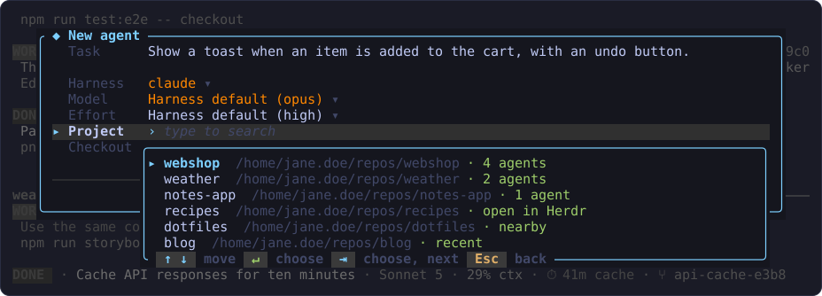
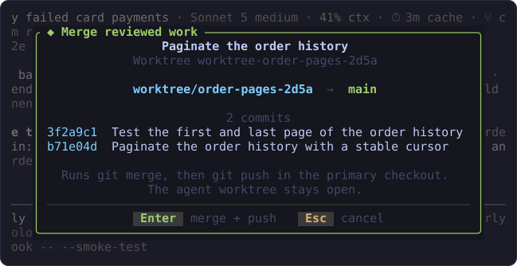
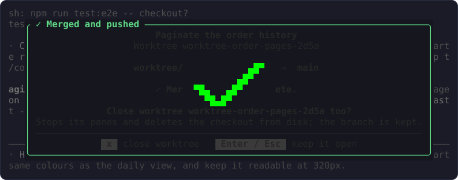
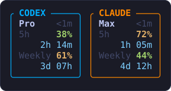

<p align="center">
  
</p>

<p align="center">
  <b>The dashboard for your Herdr agents.</b><br>
  Every coding agent in your Herdr session in one pane, grouped by project:
  what it is doing, what it waits on, and what its context and prompt cache
  cost you. Easily send prompts, start new sessions and close old ones
  directly from the same place.
</p>


## Install as a Herdr plugin

You need Herdr 0.8.2 or newer on Linux or macOS, and a Rust toolchain for
the build step.

```bash
herdr plugin install zyrre/corgi
```

Herdr clones the repository, shows what it will run, and after you confirm,
builds Corgi (`cargo build --release`) and registers the plugin. Run the same
command again to update, and `herdr plugin uninstall io.github.zyrre.corgi`
to remove it.

To open the dashboard with one key, or focus it when it is already open,
bind the plugin's `open` action in `~/.config/herdr/config.toml`, then run
`herdr server reload-config`:

```toml
[[keys.command]]
key = "prefix+d"
type = "plugin_action"
command = "io.github.zyrre.corgi.open"
description = "Corgi (open or focus)"
```

## What you get

- **One row per agent**, for any agent kind Herdr can start, including Codex
  and Claude Code. Rows are grouped by project, and what needs you comes first.
- **What each agent is doing**: the newest thing said in its session and the
  command or tool it runs, read from the session file its CLI writes.
- **What it costs**: the model and effort answering it, how full its context
  window is, and how long its prompt cache stays warm.
- **Its transcript in place**: `space` opens the selected session's latest
  turns without leaving the list.
- **New agents in their own worktree**: `n` starts an agent on a fresh branch
  and checkout, with its first prompt, and `m` merges its work back when you
  are done.
- **A Steward per project**: a long-lived agent that you talk to about what to
  build and that dispatches the work to worktree agents.
- **Plan usage**: the 5-hour and weekly limits of each installed CLI, in the
  header.

### Keys

| Key | Action |
| --- | --- |
| `j` / `k`, arrows | Select an agent |
| `space` | Expand the selected session into its transcript, or collapse it again |
| `u` / `d`, `PgUp` / `PgDn`, `Home` / `End` | Scroll the expanded transcript |
| `p` | Prompt the selected agent (idle, done, working and unknown agents; a blocked one waits on its own question) |
| `n` | Start a new agent in its own worktree; with no agent selected, the most recently used project is preset |
| `t` | Start a [scratch session](#scratch-sessions) in your home directory |
| `s` | Start the [Steward](#the-steward) of the selected agent's project, or focus it when one is already running |
| `m` | [Merge and push](#merging) an agent's worktree branch (asks first) |
| `f` or `Enter` | Focus the selected agent's pane |
| `x` | [Close](#closing-an-agent) the selected agent; for a worktree agent this also deletes its checkout (asks first) |
| `r` | Refresh now |
| `Esc` | Collapse the expanded transcript, or close Corgi |
| `q` | Close Corgi |

Prompts go through Herdr's agent API. The dashboard opens as a Herdr tab;
for a compact popup instead, open the plugin's `quick` pane:
`herdr plugin pane open --plugin io.github.zyrre.corgi --entrypoint quick`.

### Reading a row


Each agent takes three rows:

- **Identity row**: its state, the task its CLI summarizes, the model and
  thinking effort, context used, the prompt cache, and its worktree checkout.
  A narrow pane drops these fields from the right before it clips the task.
- **Message row**: the newest thing said in the session. The live terminal
  fills in what the session file lacks, such as a permission prompt waiting
  for you.
- **Tool row**: the command or tool the agent is running, or ran last, with
  its whole argument.

The marker in front of the message and tool rows says what they show:

| Marker | Row shows |
| --- | --- |
| `»` | Your prompt |
| `›` | The agent's reply |
| `…` | Its thinking, or a progress notice while it works |
| `?` | A question it is waiting on |
| `$` | A shell command |
| `●` | Any other tool, such as a file read or edit |
| `○` | Nothing yet |

**Prompt cache.** Corgi counts down how long a Claude Code session's prompt
cache stays warm, from the cache lifetime Claude Code records for every
request in its transcript. The countdown `⏱ 52m cache` turns yellow in the
last five minutes and red in the last minute, so a session worth prompting
before its cache lapses stands out. Once the cache has gone cold, the field
warns with the size of the context the next turn will re-read at full price,
for example `⚠ 182k re-read`.

GPT-5.6 Codex sessions show an estimate instead, `≈ 18m cache`, counted from
the latest cache hit or write in the rollout. OpenAI guarantees that cache
prefix for at least 30 minutes, but Codex does not record its exact
lifetime, so after that the field only says `⚠ cache may be cold`.

### Read a session in place


`space` expands the selected session in place. Its message row grows down
to the bottom of the box, into the session's latest turns, newest first:
what each side said, and every command and tool call in between. The newest
turn, usually the agent's closing summary, is shown in full, and older turns
are held to two rows each. The project heading and the sessions above keep
their place, so opening and closing is just the one row growing and
shrinking.

While a session is expanded:

- `j` / `k` move to the next session and show it from its newest turn.
- Every other key keeps working, so you can read the transcript and then
  prompt, merge, or close that agent without collapsing it first.
- A session too far down the list for its transcript to be worth reading
  pulls the sessions above it off the top to make room.

Transcripts come from the session files Claude Code and Codex write. A
session with no readable file keeps its two normal rows and says why there
is nothing more.

## Everyday use

### How the list is ordered

The dashboard shows a heading for every project that has an agent session.
The project's Steward always comes first under its heading. The other agents
follow by state, so what needs attention is on top: blocked, working, done,
idle, then those whose state is unknown. Within a state, the agent that
entered it most recently comes first, then the rest alphabetically when
Herdr reports no order between them. Scratch sessions are ordered the same
way. A row moves only when its own agent changes state, and the selection
stays on the same row.

Agents in linked worktrees are listed as `repo/checkout`, for example
`webshop/order-pages-2d5a`. Other agents in the project's workspace, such as
shared-checkout tabs or a worker in its root tab, are named after the
repository.

### Start an agent


`n` opens the new-agent form in its task row, with everything else preset:
the selected agent's repository (or the project you used most recently), the
default harness, that harness's own model and effort, a fresh worktree, and a
session name taken from the project directory. Type the task and press
`Enter`.

Below the task is one short list of settings: Harness, Model, Effort (for
Codex and Claude Code), Project, and Checkout. The same keys work on every
row:

| Key | In the form |
| --- | --- |
| `↑` / `↓`, `Tab` / `Shift+Tab` | Move between the task and the settings (`↓` on the task's last line steps into the settings; `Tab` wraps) |
| `←` / `→` | Change the setting in place: next harness, model, effort level, or the other checkout |
| `Space`, or just start typing | Open the setting's list, filtered by what you type |
| `Enter` | Create the agent |
| `Esc` | Cancel |

In an open list, typing filters, `↑` / `↓` move, `Enter` chooses, `Tab`
chooses and moves to the next setting, and `Esc` closes the list and leaves
the value unchanged. The harness and model lists also offer whatever you
typed as a value of its own, so a model or agent kind Corgi does not know can
still be used.

If `Enter` cannot create the agent yet, for example because there is no task
or the project directory does not exist, the form stays open, says why, and
moves the cursor to the row that needs a value.

**The first agent of a project is its Steward.** For a new project, or a
project with no agent session in any of its workspaces, `Enter` starts the
project's [Steward](#the-steward) instead of a worker, with your task as its
first request. The form says so in its title and in a line above the keys.
The Steward starts on the harness, model, and effort chosen in the form when
that harness is Claude Code or Codex; for any other harness, the form asks
you to pick one of those two. Once any agent works in the project, the form
starts workers as usual.

#### Harness, model and effort

- **Harness.** The list marks the CLIs found on this machine and offers
  `codex`, `claude`, `gemini`, `copilot`, and `opencode`; any other kind
  Herdr supports can be typed. The preset is the first of `codex` or
  `claude` that Corgi finds; set `CORGI_DEFAULT_AGENT` (for example
  `CORGI_DEFAULT_AGENT=claude`) to change it. Switching harness clears a
  model the new one cannot run.
- **Model.** The row starts on "Harness default", which leaves the choice to
  the CLI's own configuration. Where Corgi can read that configuration, it
  names the value in parentheses, so the row says what you will actually get:
  - Claude Code: `model`, `effortLevel`, and per-model `modelSettings`
    overrides from `~/.claude/settings.json` (`settings.local.json` is read
    first, when present).
  - Codex: the top-level `model` and `model_reasoning_effort` from
    `~/.codex/config.toml`.

  A harness whose configuration Corgi does not read just shows "Harness
  default", with nothing in parentheses; Corgi never guesses a CLI's built-in
  default. Choosing a model updates the effort hint, because the level can be
  configured per model.

  Corgi refreshes the Codex list from its locally authenticated App Server,
  and the OpenCode list from `opencode models`, without blocking the UI. The
  result is cached while the dashboard runs, and it shows up in a list that
  is already open. Until a refresh succeeds, or when a harness has no
  catalog, Corgi falls back to its own curated model list. Any other model
  the CLI accepts can be typed into the list and chosen as typed. Corgi
  passes the selection to Herdr as `--model`.
- **Effort.** Shown for Codex and Claude Code: `low`, `medium`, `high`,
  `xhigh`, and `max`. The default leaves the CLI's own setting in charge. A
  chosen level reaches Codex as `-c model_reasoning_effort=<level>` and
  Claude Code as `--effort <level>`. Other harnesses have no effort control,
  so the row is left out for them.

Herdr runs plugin panes with a minimal `PATH`, so Corgi also looks in the
usual install directories (`~/.local/bin`, `/opt/homebrew/bin`, npm, bun,
nvm, cargo, volta). If a CLI is installed somewhere else, point
`CORGI_CODEX_BIN` or `CORGI_CLAUDE_BIN` at it.

### Choosing a project



To start an agent in another project, use the form's Project row: press
`Space` or start typing on it. When no agent is selected and Corgi knows no
project at all, the form opens with this list already open. It lists every
project Corgi knows, in this order:

1. projects with running agents;
2. repositories with a workspace open in Herdr, with or without an agent
   (Herdr keeps a repository's primary workspace open while any of its
   worktree workspaces exist, so this is Herdr's own idea of a project);
3. sibling directories of currently open projects, such as the other
   repositories in your `repos` directory;
4. projects Corgi remembers from before.

Type to filter by name or path. While you type an absolute path, matching
directories are offered as completion rows; choose one with `Enter`. A
complete directory path is offered too, so a project Corgi has never seen
can be used without leaving the form.

**New projects.** Type the new project's name and choose the `new project`
row; `↑` wraps straight to it when other projects match. The new project goes
in the directory most known projects share, such as `~/repos`, or in your
home directory when Corgi knows no project yet. To put it somewhere else,
type the full path instead (`~` works too). Corgi creates the directory and
starts the project's Steward there with your task. The Checkout row is
hidden, since there is nothing to branch a worktree from yet. The Steward
makes the directory a repository with a first commit, shaped by your task,
and can then start worktree agents.

**Remembered projects.** Corgi remembers a project when it starts an agent
there and when it sees the repository open in Herdr. The list is a plain text
file with one absolute path per line, most recently used first, at
`$XDG_STATE_HOME/corgi/projects` (`~/.local/state/corgi/projects` by
default; `CORGI_PROJECTS_FILE` overrides the location). Edit or delete it
freely; directories that no longer exist are skipped. To make a repository
known without running anything in it, open a workspace for it in Herdr:

```bash
herdr workspace create --cwd ~/repos/webshop --no-focus
```

### Worktrees

By default, each new agent gets its own Git worktree. Corgi asks Herdr for
the repository behind the project directory, so pressing `n` on an agent
that already works in a worktree creates a sibling worktree of the same
repository, not a worktree of a worktree. Herdr picks a fresh
`worktree/<name>` branch from `HEAD` and checks it out under its
`worktrees.directory` (`~/.herdr/worktrees/<repo>/<branch-slug>` by
default).

The first time Corgi launches an agent for a Git repository, it also creates
one agentless project workspace, labelled `<project> steward` (for example
`webshop steward`), because its root tab is where the project's Steward can
run. It marks that workspace as Corgi-managed in Herdr metadata.

- Every worktree Corgi creates is grouped below that workspace, not below
  the Corgi dashboard or an unrelated workspace. Closing or restarting the
  dashboard therefore cannot close those workers.
- An existing Herdr workspace is never adopted just because it has the same
  name.
- A project workspace that still has the bare repository name from an older
  Corgi is relabelled the first time Corgi sees it; a label you chose yourself
  is kept.

To start the agent in the shared directory instead, switch the Checkout row
to "Project directory as is" with `←` / `→` or `Space`. In a Git project the
agent then gets its own tab under the same Corgi project workspace, and
closing it does not affect the root tab or other agents. Directories outside
a Git work tree always use the plain directory, and the status line says so.

### Merging



When you have reviewed a worktree agent's work, press `m` to merge it. The
confirmation shows the task, the worktree, the source branch, the branch
currently checked out in the repository's primary checkout, and the commits
the merge brings in. Corgi checks that both checkouts are clean before it
asks, and checks again after you press `Enter`, in case anything changed
while the dialog was open. Only then does it run `git merge --no-ff
--no-edit` followed by `git push`. The popup stays open with a spinner while
those commands run, and it reports any merge or push error.



A successful merge is stamped with a check. Corgi never switches branches
and never removes the worktree on its own: the finished popup offers to
close the worktree with `x`, or to keep it open. Resolve any reported
conflicts in the primary checkout, and use `x` when you are ready to remove
the agent.

### Closing an agent

`x` on a worktree agent runs Herdr's `worktree remove`: it stops the panes,
closes the workspace, and deletes the checkout from disk. If the checkout
still has uncommitted changes, Corgi refuses once and asks again before it
forces the removal. The branch is never deleted, so committed work survives;
prune stale `worktree/*` branches with `git branch -D` once you no longer
need them.

After closing a Corgi agent, Corgi checks its project workspace. It retires
that workspace only when no project agent, linked worktree workspace, or
extra tab is left. If it finds a workspace it does not own, cleanup stops
rather than risk someone else's session.

### Scratch sessions

`t` starts a scratch agent in your home directory. It opens the new-agent
form preset for `~`, and the task may be left empty so you can type into the
session yourself. A scratch session gets a plain `scratch` workspace, never a
worktree or a Steward, and is listed under Scratch.

## The Steward

Each project can have one Steward: a long-lived Claude Code or Codex session
in the root tab of the project's Corgi workspace. You talk to it about what
to build, and it dispatches the work to worktree agents and reviews what
they report. Its role is [`steward/ROLE.md`](steward/ROLE.md).


Press `s` in the dashboard to start the selected agent's Steward, or to
focus it when it already runs. It starts on the harness, model, and effort
it was last launched with (the first time, on the new-agent form's
presets), and greets you with the project's state. The
first agent you start in a new project is its Steward too. From a shell:

```bash
corgi steward ~/repos/webshop                    # greets with the project's state
corgi steward ~/repos/webshop < first-request.md # takes that request up instead
corgi steward ~/repos/webshop --harness codex    # on Codex instead of Claude Code
```

The Steward starts workers with [`corgi spawn`](#corgi-spawn), lists them
with `corgi fleet`, and reads each one's final report with `corgi report`.
It does not poll: while a dashboard runs, it prompts the Steward with one
line whenever one of the project's agents becomes done, idle, or blocked
after working. The Steward keeps its decisions, a ledger of dispatched work,
and every brief it sent outside the repository, in
`$XDG_STATE_HOME/corgi/steward/<project>/`.

## For scripts and other agents

### `corgi spawn`

`corgi spawn` starts an agent exactly as the new-agent form does, for
callers without a dashboard, such as a coordinating agent in the project's
root tab. Run it from inside Herdr; it uses the session's injected socket.
The task is read from stdin (or `--task-file`), so a long brief needs no
shell quoting:

```bash
corgi spawn --project ~/repos/webshop --harness claude --model opus --effort high <<'EOF'
Add a --json flag to ...
EOF
```

Every option defaults to what the form would preset: the current directory,
the default harness, that harness's own model and effort, and a fresh
worktree (`--checkout directory` for the shared checkout). When a Steward
runs `corgi spawn` without `--harness`, the worker starts on the Steward's
own harness, so a Codex Steward's workers are Codex sessions and a Claude
Code Steward's are Claude Code sessions. `--name` picks the agent name,
which must not be in use.

Progress goes to stderr. On success, the new agent is printed to stdout as
one JSON object with its `name`, `pane_id`, `workspace_id`, `tab_id`, `cwd`,
and `location`, ready for `herdr agent prompt`, `wait`, and `read`. Run
`corgi spawn --help` for the full list of options.

## Plan usage



The header shows one card per CLI Corgi can find. Each card shows the plan,
how old the reading is, and the 5-hour and weekly usage with the time until
each window resets. A percentage turns yellow from 60% and red from 85%.

- **Codex**: Corgi starts a short-lived `codex app-server` and asks it for
  the account's rate limits. This needs a signed-in `codex`.
- **Claude Code**: Corgi reads the OAuth token that Claude Code already
  stores (`~/.claude/.credentials.json`, or the macOS Keychain entry
  "Claude Code-credentials") and calls Anthropic's usage endpoint with
  `curl`. This needs a signed-in `claude` and `curl`. This reuse of Claude
  Code's stored login is unofficial and read-only: Corgi only reads usage and
  never changes the account. The endpoint is not documented, so the reading
  may break if it changes.

One Corgi process at a time fetches a new reading, at most once a minute,
and shares it with the others through `$XDG_STATE_HOME/corgi/usage/`. A
failed reading never blocks the dashboard. The card keeps its last good
reading; a CLI with no reading at all gets no card, and the header's top
right corner says why instead, such as an expired login. To check the Claude
reader by hand:

```bash
cargo test -- --ignored live_claude_usage --nocapture
```

## Reference

### Configuration

| Variable | Effect |
| --- | --- |
| `CORGI_DEFAULT_AGENT` | The harness the new-agent form presets, instead of the first of `codex` or `claude` found |
| `CORGI_CODEX_BIN`, `CORGI_CLAUDE_BIN` | Where the Codex or Claude Code CLI is, when it is outside the usual install directories |
| `CORGI_PROJECTS_FILE` | Where the list of remembered projects is kept |
| `CORGI_STEWARD_BIN` | The Corgi binary a Steward's commands call, for example a development build |
| `XDG_STATE_HOME` | Where Corgi keeps its state (`~/.local/state` by default) |

Under `$XDG_STATE_HOME/corgi/`, Corgi keeps `projects` (remembered
projects), `created-projects` (projects Corgi created), `steward/<project>/`
(each Steward's memory), `wake/` (the lock that decides which dashboard
wakes Stewards), and `usage/` (the shared plan-usage reading).

### Data and privacy

All agent control goes through the Herdr socket supplied in
`HERDR_SOCKET_PATH`. Prompt text is sent over that socket and is not placed
in process arguments. Corgi sends no telemetry, does not persist terminal
output, and writes no prompt history. Terminal text is rendered as plain
text after bounded cleanup and redaction of common tokens.

The only other network activity is the plan-usage reading: `codex
app-server` talks to OpenAI on Codex's behalf, and the Claude card sends the
locally stored Claude Code token to `api.anthropic.com` only. The token is
passed to `curl` on stdin, never as an argument, and Corgi does not store
it.

### Architecture

See [ARCHITECTURE.md](ARCHITECTURE.md) for the socket and API boundaries,
and why Corgi does not need a separate backend.

### Optional Omarchy companion

The `omarchy/` directory contains a bar widget you can install on its own.
Its corgi icon opens a compact dashboard with project groups, agent
activity, model and context information, cache estimates, and plan usage. It
uses Corgi's `--bar-stream <socket-path>` mode to share the dashboard's data
readers. See [the companion README](omarchy/README.md) for setup and
controls.

### Build from source

To work on Corgi, link a checkout instead of installing it. Both use the
same plugin id, so run `herdr plugin uninstall io.github.zyrre.corgi` before
you link. Herdr refuses to install over a linked plugin, so to go back,
`herdr plugin unlink io.github.zyrre.corgi` first.

```bash
git clone https://github.com/zyrre/corgi && cd corgi
cargo build --release
herdr plugin link "$PWD"
```

[AGENTS.md](AGENTS.md) has the checks to run before handing off a change.

### Screenshots

The images in this README are drawn by Corgi's own UI code, using made-up
agents, and written as SVG to `docs/images/`. Run `cargo readme-shots` to
draw them again after a UI change.

## License

MIT
